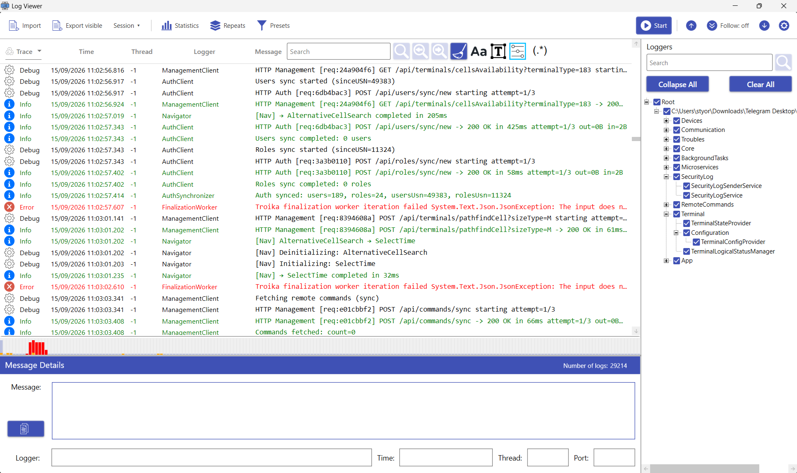
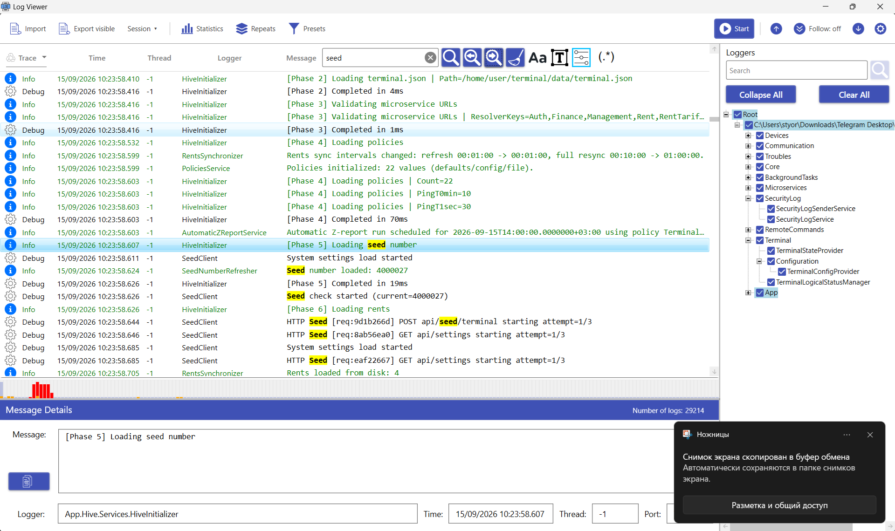
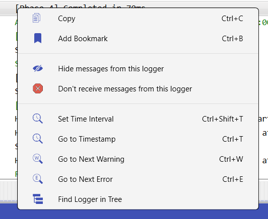
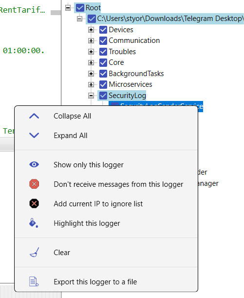
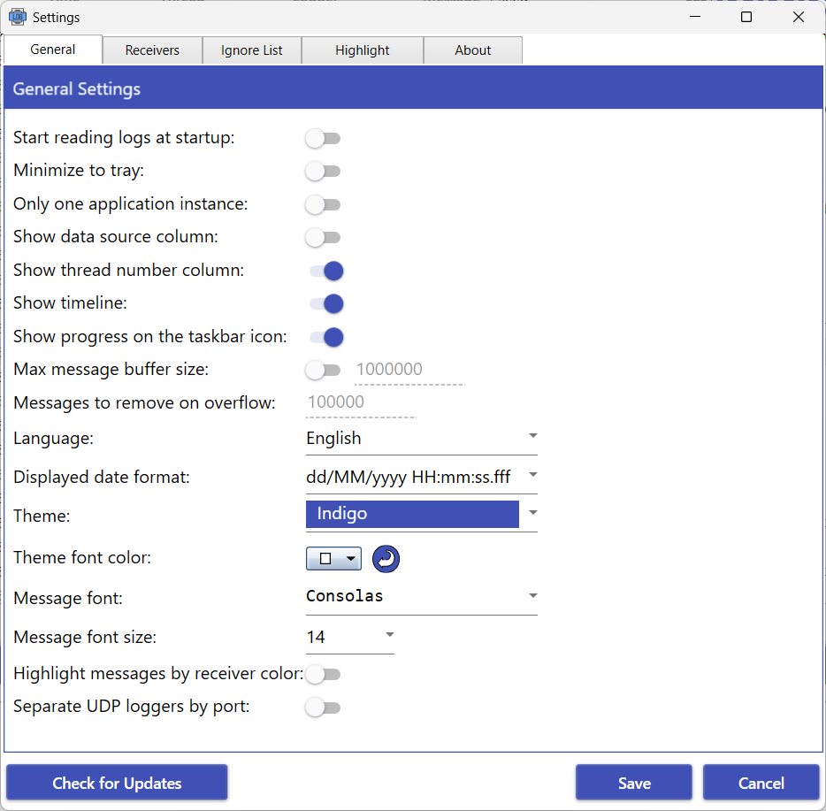
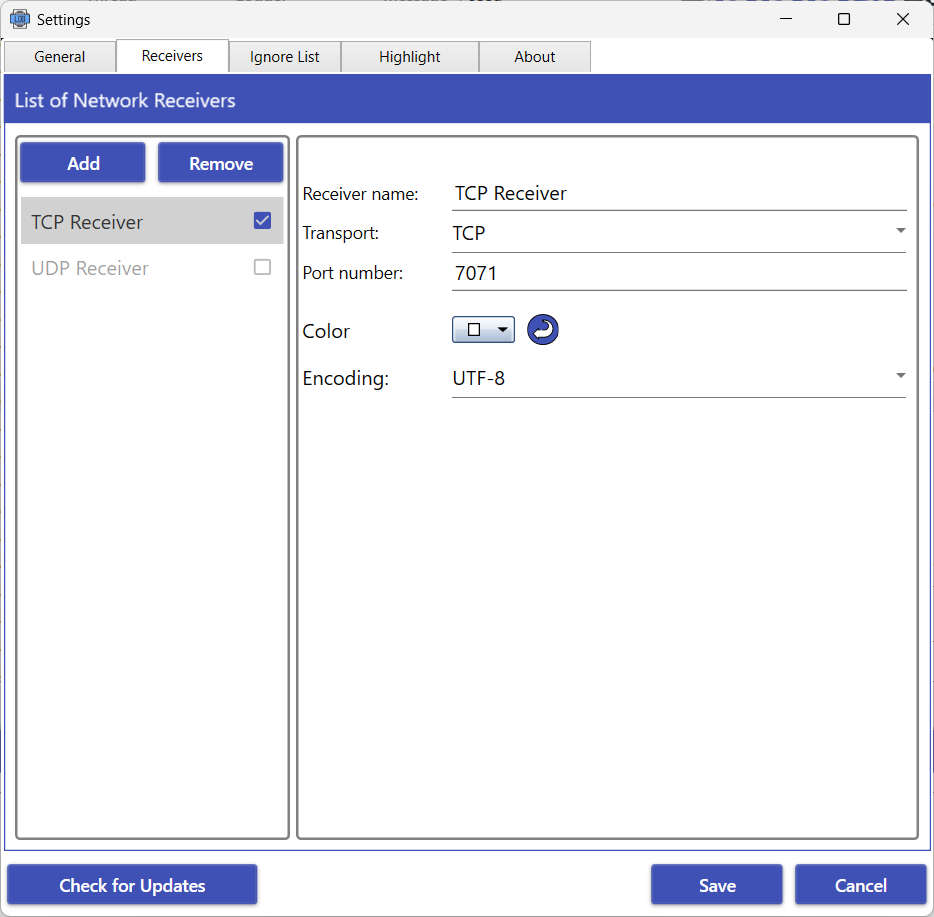
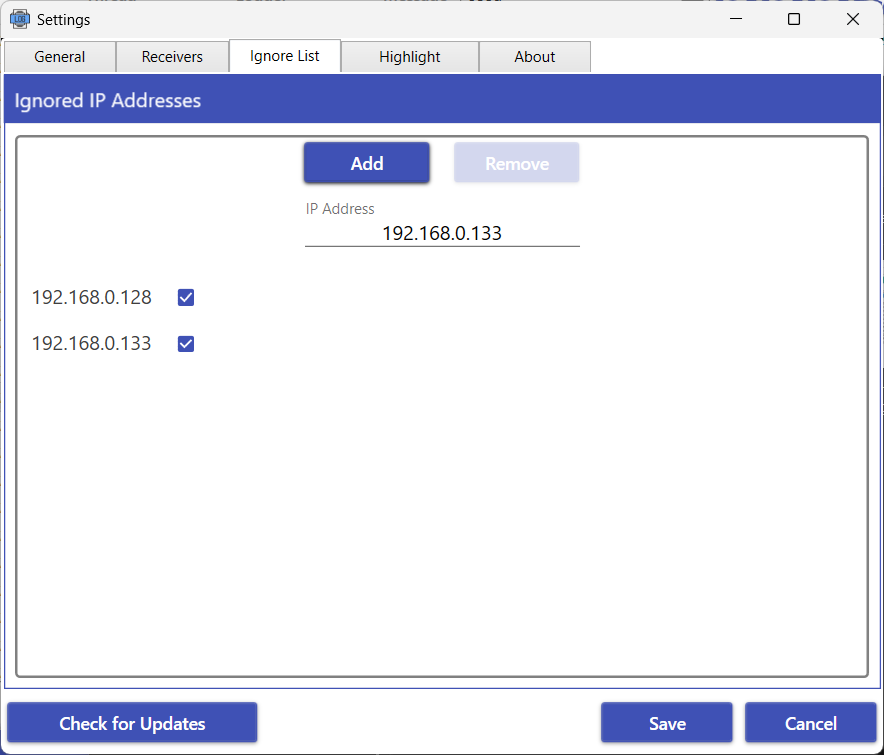

# LogViewer

[](LICENSE)
[](https://dotnet.microsoft.com/download/dotnet-framework/net48)
[](https://sourceforge.net/projects/styort-logviewer/)
[](https://sourceforge.net/projects/styort-logviewer/files/latest/download)

Windows desktop viewer for **NLog**, **log4net**, and **log4j** logs. It receives Chainsaw / NLogViewer XML over **UDP or TCP**, imports text files and archives, and keeps a large in-memory buffer usable while you filter, search, and jump around.

The interface is in **Russian** and **English**. Current release line: **1.2.8**.

<p align="center">
  
</p>

## Download

<a href="https://sourceforge.net/projects/styort-logviewer/files/latest/download"></a>

Requires **Windows** and **.NET Framework 4.8**. Windows 10 version 1903 and later, and Windows 11, already include that runtime. The build published on SourceForge.

## Features

### Live receivers

- UDP and TCP listeners for Chainsaw / NLogViewer / log4j XML. Several ports at once; each receiver has its own color.
- TCP accepts multiple clients on one port (NLog `NLogViewer`, `address="tcp://host:port"`). An event split across TCP segments is reassembled before it is parsed.
- Start and stop receivers without closing the app. Ignored IP addresses are dropped on arrival.
- Per-logger **Don't receive** skips events before they enter the buffer. Optional split of the logger tree by receiver port.

### Import

- `.txt` and `.log` by a layout template, including NLog layouts. Drag-and-drop, command line, and Open with.
- `.zip` and `.rar`, including nested folders. Logs are extracted next to the archive, parsed, then the extract folder is removed.
- Tail of a large file: the whole file, the last N megabytes, or the last N hours relative to the last record.
- Optional live follow: new lines appended to an imported file show up in the list.

### Find and narrow

- Logger tree with show, hide, and don't-receive. Minimum level and a time interval.
- Search as plain text or regex, with match case, whole word, and an optional level. Matches run across message, logger, address, thread, executable, throwable, and MDC properties, and are highlighted in the message column.
- Separate results window (**Ctrl+Shift+F**). Double-click a hit to select that row in the main list.
- Named **filter presets**: minimum level, search, and selected loggers, applied in one step. Stored in `filter_presets.xml` next to settings.
- Jump to a timestamp, the next warning, or the next error.

### Work with the list

- Bookmarks with a comment, a jump list, and **Ctrl+B**.
- Copy the selected rows (**Ctrl+C**).
- **Export** (**Ctrl+S**) writes the currently visible, filtered rows to a text file.
- **Session** (**Ctrl+Shift+S** / **Ctrl+O**) saves a file you choose (`.lvs` or gzip `.lvs.gz`): the log buffer, bookmarks with comments, hidden loggers, and Don't Receive. The file is never written to Documents on its own.
- Logger statistics: counts, share, levels, last write time, and a jump into the message.
- Repeats window: identical messages grouped by level, logger, and normalized text (GUIDs, dates, and long numbers folded away). Count, first and last time, jump to either end. The main list stays expanded.
- Timeline under the list: message density in the background, Warn / Error / Fatal stacked on the same buckets. A click jumps to the first message in that interval.
- Highlight rules: a persistent row color by level, logger, or message text (substring or regex), with adjustable opacity. Rule order is priority. Rules color rows only; they do not filter the list and they ignore the current search.

### Appearance

- Themes and a custom font color.
- Font family and size for the list and the details pane.
- Show or hide the source and thread columns. Date format, tray icon, single instance, and a cap on the in-memory buffer.
- **Follow** keeps the list scrolled to the newest row. Turn it off to stay put while new logs arrive.

## Send logs

Add a receiver in **Settings → Receivers** (a new receiver defaults to port **7071**), then start it.

NLog, UDP:

```xml
<target name="viewer" xsi:type="NLogViewer" address="udp://127.0.0.1:7071" />
```

NLog, TCP:

```xml
<target name="viewer" xsi:type="NLogViewer" address="tcp://127.0.0.1:7071" />
```

log4net:

```xml
<appender name="UdpAppender" type="log4net.Appender.UdpAppender">
  <remoteAddress value="127.0.0.1" />
  <remotePort value="7071" />
  <layout type="log4net.Layout.XmlLayoutSchemaLog4j">
    <locationInfo value="true" />
  </layout>
</appender>
```

The same XML event format is what Chainsaw and log4j socket appenders emit.

## Keyboard shortcuts

| Shortcut | Action |
| --- | --- |
| Ctrl+F | Search and filter the main list |
| Ctrl+Shift+F | Search results in another window |
| Shift+F / Shift+D | Next / previous match |
| Shift+R | Clear the search |
| Ctrl+R | Clear all logs |
| Ctrl+S | Export the visible rows to a text file |
| Ctrl+Shift+S | Save a session |
| Ctrl+O | Open a session |
| Ctrl+W / Ctrl+E | Next warning / next error |
| Ctrl+T | Go to a timestamp |
| Ctrl+Shift+T | Set the time interval |
| Ctrl+B | Toggle a bookmark on the selected rows |
| Ctrl+C | Copy the selected rows |

## Where files live

| File | Location |
| --- | --- |
| `settings.xml` | `%Documents%\LogViewer\`, or next to the executable if that copy exists and Documents does not |
| `filter_presets.xml` | Same folder as settings |
| `template_import_settings.xml` | Same folder as settings |
| Session (`.lvs`, `.lvs.gz`) | Whatever path you pick in Save / Open |

## Screenshots

Search in the main list:



Log entry and logger dialogs:

<p>
  
  
</p>

Settings — general, receivers, ignored addresses:

<p>
  
  
  
</p>

## Build

Open `src/LogViewer.sln` in Visual Studio 2022 with the **.NET desktop development** workload, restore NuGet packages, and build. The app targets **.NET Framework 4.8**.

```
src/LogViewer.sln
src/LogViewer.csproj            WPF UI, settings, commands
src/LogViewer.Core/             parsers, filter, receivers, session (no UI)
src/LogViewer.Core.Tests/       NUnit
src/LogViewer.App.Tests/        view-model tests
```

Domain logic belongs in `LogViewer.Core`. The WPF project stays on UI, settings, and commands.

```
dotnet test src/LogViewer.Core.Tests/LogViewer.Core.Tests.csproj
dotnet test src/LogViewer.App.Tests/LogViewer.App.Tests.csproj
```

Tests cover parsers, filtering, receivers, and view-model behavior. They do not cover XAML, ClickOnce, or a live UDP socket.

## License

[GNU GPL-3.0](LICENSE). You can use, modify, and share this program under that license; derivative work stays under GPL-3.0.

Issues and pull requests are welcome on [GitHub](https://github.com/Styort/LogViewer/issues).
