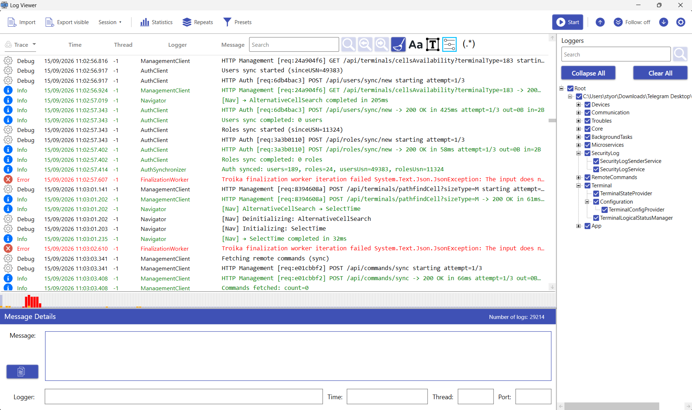
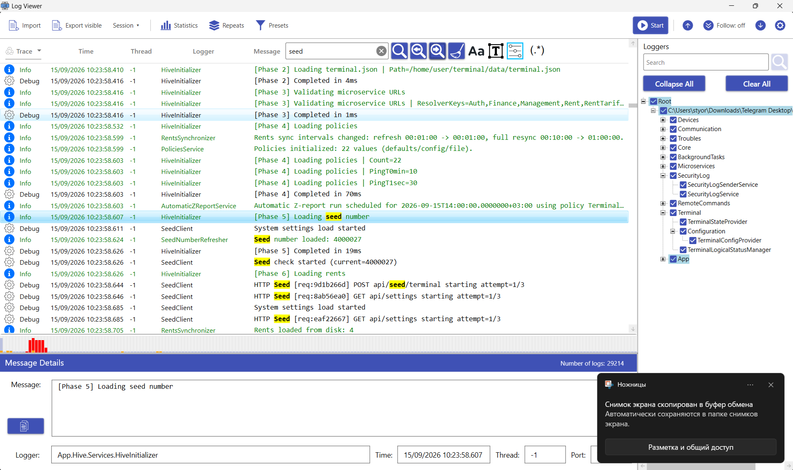
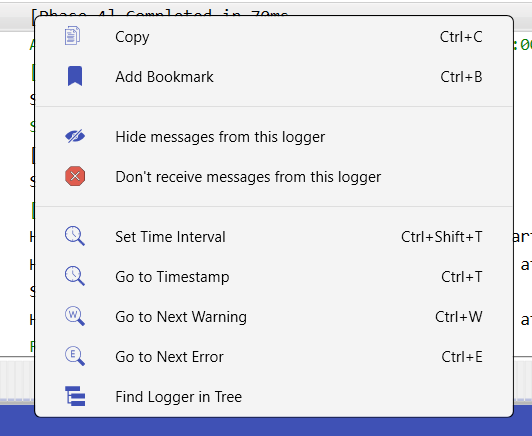
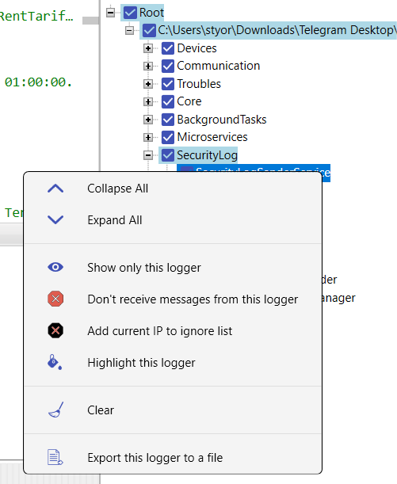
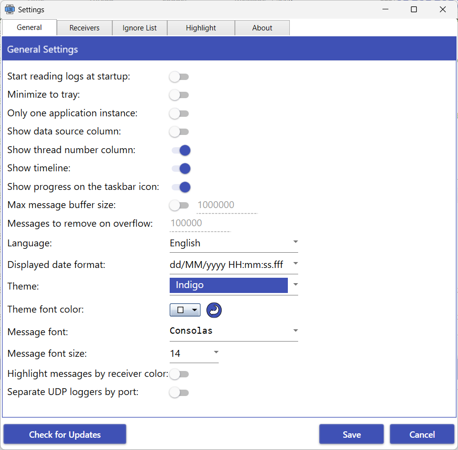
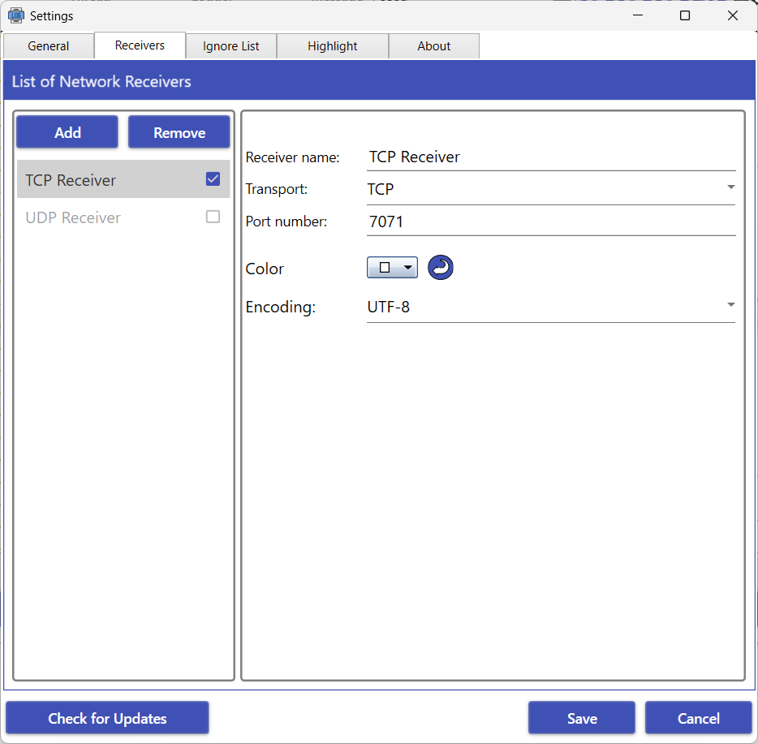
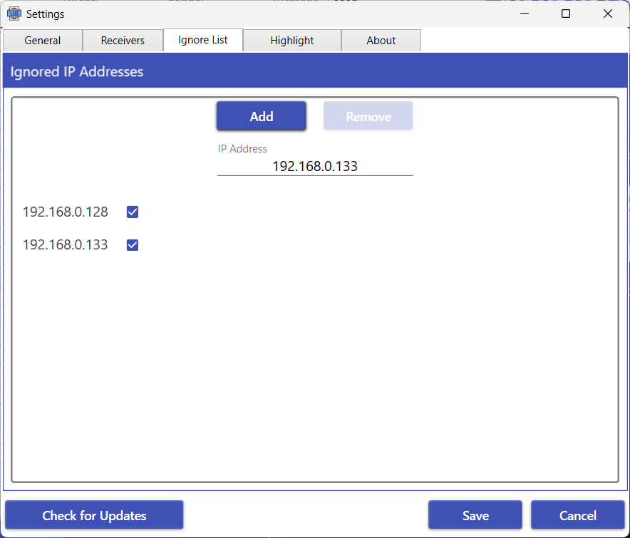

# LogViewer

[](https://github.com/Styort/LogViewer/actions/workflows/build.yml)
[](https://github.com/Styort/LogViewer/releases/latest)
[](https://github.com/Styort/LogViewer/releases)
[](https://sourceforge.net/projects/styort-logviewer/files/latest/download)
[](LICENSE)
[](https://dotnet.microsoft.com/download/dotnet-framework/net48)
[](https://sourceforge.net/projects/styort-logviewer/)

Windows desktop viewer for **NLog**, **log4net**, and **log4j** logs. It receives Chainsaw / NLogViewer XML over **UDP or TCP**, imports text files and archives, and keeps a large in-memory buffer usable while you filter, search, and jump around.

The interface is in **Russian** and **English**.

<p align="center">
  
</p>

## Download

[](https://github.com/Styort/LogViewer/releases/latest)

1. Open the [latest release](https://github.com/Styort/LogViewer/releases/latest) and download `LogViewer-<version>.zip` from **Assets**.
2. Extract it to any folder you can write to and run `LogViewer.exe`.

Requires **Windows** and **.NET Framework 4.8**. Windows 10 version 1903 and later, and Windows 11, already include that runtime. The executable is not code-signed, so Windows SmartScreen may warn on the first start: choose **More info → Run anyway**.

Older builds are also available on [SourceForge](https://sourceforge.net/projects/styort-logviewer/files/latest/download).

## Features

### Live receivers

- UDP and TCP listeners for Chainsaw / NLogViewer / log4j XML. Several ports at once; each receiver has its own color.
- TCP accepts multiple clients on one port (NLog `NLogViewer`, `address="tcp://host:port"`). An event split across TCP segments is reassembled before it is parsed.
- Start and stop receivers without closing the app. Ignored IP addresses are dropped on arrival.
- Per-logger **Don't receive** skips events before they enter the buffer. Optional split of the logger tree by receiver port.

### Import

- `.txt` and `.log` by a layout template, including NLog layouts. Drag-and-drop, command line, and Open with.
- `.zip` and `.rar`, including nested folders. Logs are extracted next to the archive, parsed, then the extract folder is removed.
- Tail of a large file: the whole file, the last N megabytes, or the last N hours relative to the last record.
- Optional live follow: new lines appended to an imported file show up in the list.

### Find and narrow

- Logger tree with show, hide, and don't-receive. Minimum level and a time interval.
- Search as plain text or regex, with match case, whole word, and an optional level. Matches run across message, logger, address, thread, executable, throwable, and MDC properties, and are highlighted in the message column.
- Separate results window (**Ctrl+Shift+F**). Double-click a hit to select that row in the main list.
- Named **filter presets**: minimum level, search, and selected loggers, applied in one step. Stored in `filter_presets.xml` next to settings.
- Jump to a timestamp, the next warning, or the next error.

### Work with the list

- Bookmarks with a comment, a jump list, and **Ctrl+B**.
- Copy the selected rows (**Ctrl+C**).
- **Export** (**Ctrl+S**) writes the currently visible, filtered rows to a text file.
- **Session** (**Ctrl+Shift+S** / **Ctrl+O**) saves a file you choose (`.lvs` or gzip `.lvs.gz`): the log buffer, bookmarks with comments, hidden loggers, and Don't Receive. The file is never written to Documents on its own.
- Logger statistics: counts, share, levels, last write time, and a jump into the message.
- Repeats window: identical messages grouped by level, logger, and normalized text (GUIDs, dates, and long numbers folded away). Count, first and last time, jump to either end. The main list stays expanded.
- Timeline under the list: message density in the background, Warn / Error / Fatal stacked on the same buckets. A click jumps to the first message in that interval.
- Highlight rules: a persistent row color by level, logger, or message text (substring or regex), with adjustable opacity. Rule order is priority. Rules color rows only; they do not filter the list and they ignore the current search.

### Appearance

- Themes and a custom font color.
- Font family and size for the list and the details pane.
- Show or hide the source and thread columns. Date format, tray icon, single instance, and a cap on the in-memory buffer.
- **Follow** keeps the list scrolled to the newest row. Turn it off to stay put while new logs arrive.

## Send logs

Add a receiver in **Settings → Receivers** (a new receiver defaults to port **7071**), then start it.

NLog, UDP:

```xml
<target name="viewer" xsi:type="NLogViewer" address="udp://127.0.0.1:7071" />
```

NLog, TCP:

```xml
<target name="viewer" xsi:type="NLogViewer" address="tcp://127.0.0.1:7071" />
```

log4net:

```xml
<appender name="UdpAppender" type="log4net.Appender.UdpAppender">
  <remoteAddress value="127.0.0.1" />
  <remotePort value="7071" />
  <layout type="log4net.Layout.XmlLayoutSchemaLog4j">
    <locationInfo value="true" />
  </layout>
</appender>
```

The same XML event format is what Chainsaw and log4j socket appenders emit.

## Keyboard shortcuts

| Shortcut | Action |
| --- | --- |
| Ctrl+F | Search and filter the main list |
| Ctrl+Shift+F | Search results in another window |
| Shift+F / Shift+D | Next / previous match |
| Shift+R | Clear the search |
| Ctrl+R | Clear all logs |
| Ctrl+S | Export the visible rows to a text file |
| Ctrl+Shift+S | Save a session |
| Ctrl+O | Open a session |
| Ctrl+W / Ctrl+E | Next warning / next error |
| Ctrl+T | Go to a timestamp |
| Ctrl+Shift+T | Set the time interval |
| Ctrl+B | Toggle a bookmark on the selected rows |
| Ctrl+C | Copy the selected rows |

## Where files live

| File | Location |
| --- | --- |
| `settings.xml` | `%Documents%\LogViewer\`, or next to the executable if that copy exists and Documents does not |
| `filter_presets.xml` | Same folder as settings |
| `template_import_settings.xml` | Same folder as settings |
| Session (`.lvs`, `.lvs.gz`) | Whatever path you pick in Save / Open |

## Screenshots

Search in the main list:



Log entry and logger dialogs:

<p>
  
  
</p>

Settings — general, receivers, ignored addresses:

<p>
  
  
  
</p>

## Build

Open `src/LogViewer.sln` in Visual Studio 2022 or later with the **.NET desktop development** workload, restore NuGet packages, and build. The app targets **.NET Framework 4.8**.

The WPF host is a classic (non-SDK) project with `packages.config`, so the build needs Visual Studio's MSBuild; `dotnet build` cannot compile it. From a Developer Command Prompt:

```
msbuild src/LogViewer.sln -t:Restore -p:RestorePackagesConfig=true
msbuild src/LogViewer.sln -p:Configuration=Release
```

```
src/LogViewer.sln
src/LogViewer.csproj            WPF UI, settings, commands
src/LogViewer.Core/             parsers, filter, receivers, session (no UI)
src/LogViewer.Core.Tests/       NUnit
src/LogViewer.App.Tests/        view-model tests
```

Domain logic belongs in `LogViewer.Core`. The WPF project stays on UI, settings, and commands.

`src/lib/` holds the one third-party binary that has no NuGet package (see its README).

### Tests

Run them from Test Explorer in Visual Studio, or after the MSBuild build above:

```
vstest.console.exe src/LogViewer.Core.Tests/bin/Release/net48/LogViewer.Core.Tests.dll src/LogViewer.App.Tests/bin/Release/net48/LogViewer.App.Tests.dll
```

`dotnet test` works for `LogViewer.Core.Tests` only; `LogViewer.App.Tests` references the WPF project and has to be built by MSBuild. CI ([`.github/workflows/build.yml`](.github/workflows/build.yml)) runs the same build and both test assemblies on every push and pull request.

Tests cover parsers (including concurrent parsing), filtering, UDP/TCP receivers on loopback, receiver restart, and view-model behavior. They do not cover XAML or ClickOnce updates.

### Releases

Releases are published to [GitHub Releases](https://github.com/Styort/LogViewer/releases) by [`.github/workflows/release.yml`](.github/workflows/release.yml) when a version tag is pushed:

1. Set the new version in `src/Properties/AssemblyInfo.cs` (`AssemblyVersion` and `AssemblyFileVersion`, four parts).
2. Add an entry for that version to `src/ReleaseNotes.xml`. The release description is generated from its English text.
3. Commit, push, then tag and push the tag:

```
git tag v1.2.8.10
git push origin v1.2.8.10
```

The workflow checks that the tag matches `AssemblyFileVersion` and that `ReleaseNotes.xml` has the entry, builds, runs both test projects, and attaches `LogViewer-<version>.zip`. A tag with a suffix (`v1.2.8.10-beta`) is published as a pre-release. Packaging is shared with CI in `build/stage.ps1`.

## License

[GNU GPL-3.0](LICENSE). You can use, modify, and share this program under that license; derivative work stays under GPL-3.0.

Issues and pull requests are welcome on [GitHub](https://github.com/Styort/LogViewer/issues).
